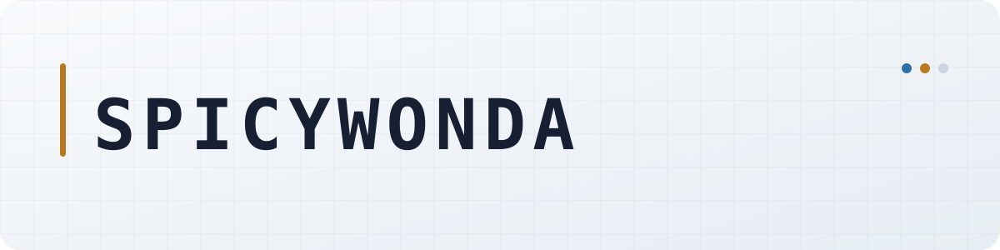

  <picture>
    <source media="(prefers-color-scheme: dark)" srcset="./assets/header-dark.svg">
    <source media="(prefers-color-scheme: light)" srcset="./assets/header-light.svg">
    
  </picture>

  &nbsp;<code>Linux</code>&nbsp;&nbsp;·&nbsp;&nbsp;&nbsp;<code>Python</code>&nbsp;&nbsp;·&nbsp;&nbsp;&nbsp;<code>JavaScript</code>&nbsp;&nbsp;·&nbsp;&nbsp;&nbsp;<code>C#</code>

Open-source developer focused on practical desktop and gaming utilities. The repositories here cover Linux display tooling, emulator workflows, game recompilation launchers, and lightweight browser integrations.

## Selected projects

<table>
  <tr>
    <td width="50%" valign="top">
      <h3><a href="https://github.com/Spicywonda/linux-cru">LCRU 2</a></h3>
      
A careful EDID editor and KMS override assistant for modern Linux desktops.

      
<code>Python</code> <code>PySide6</code> <code>Linux DRM/KMS</code>

    </td>
    <td width="50%" valign="top">
      <h3><a href="https://github.com/Spicywonda/pcsx2-cheat-sync">PCSX2 Cheat Sync</a></h3>
      
Detects a local PCSX2 library and installs matching PNACH cheats with backups and exact serial/CRC matching.

      
<code>JavaScript</code> <code>Windows</code> <code>macOS</code> <code>Linux</code>

    </td>
  </tr>
  <tr>
    <td width="50%" valign="top">
      <h3><a href="https://github.com/Spicywonda/WLauncher">WLauncher</a></h3>
      
Installs, manages, and updates game decompilation projects, recompilations, and PC ports.

      
<code>C#</code> <code>GitHub API</code> <code>Desktop</code>

    </td>
    <td width="50%" valign="top">
      <h3>Browser tools</h3>
      
Small storefront integrations for faster Steam and GOG browsing workflows.

      
<a href="https://github.com/Spicywonda/PirateX">PirateX</a> · <a href="https://github.com/Spicywonda/GOGX-Userscript">GOGX</a>

      
<code>JavaScript</code> <code>Userscripts</code> <code>Browser extensions</code>

    </td>
  </tr>
</table>

## Engineering approach

- Keep system and file changes visible, reviewable, and user-controlled.
- Validate inputs and preserve recoverable backups before modifying local state.
- Support multiple operating systems when the underlying platform permits it.

## Contribution activity

<picture>
  <source media="(prefers-color-scheme: dark)" srcset="https://raw.githubusercontent.com/Spicywonda/Spicywonda/output/pacman-contribution-graph-dark.svg">
  <source media="(prefers-color-scheme: light)" srcset="https://raw.githubusercontent.com/Spicywonda/Spicywonda/output/pacman-contribution-graph.svg">
  
</picture>

<a href="https://github.com/Spicywonda?tab=repositories">All repositories</a>

